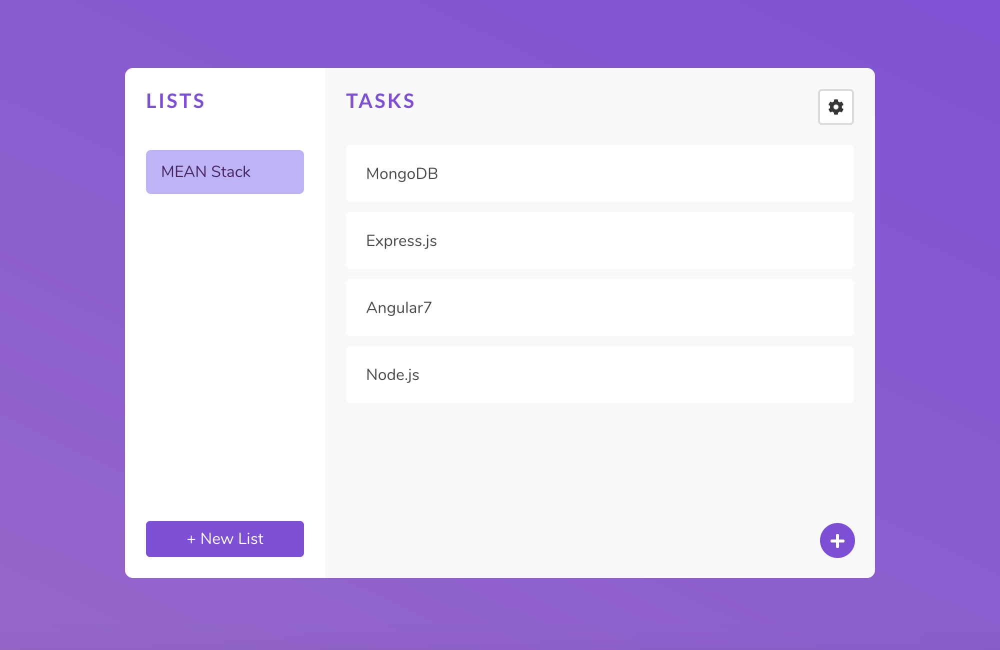
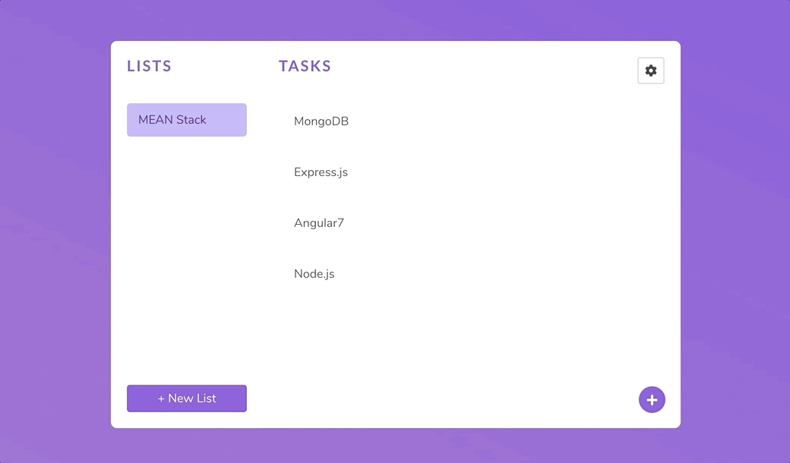

# MEAN Task Manager Application
Task manager application created using the MEAN stack (Angular, NodeJS with Express and MongoDB).

### Functionality
  - Create new Lists to organize Tasks into categories
  - Create new Tasks within a List
  - Complete, Edit, and Delete Tasks
  - Edit and Delete Lists
  
## Setup
#### Install Node Packages
Run `npm install` in both **client** and **server** directories.

#### Angular Development Server
Change directory to client using `cd client` before running any further commands.

Run `ng serve` for a dev server. 

Navigate to `http://localhost:4200/`. The app will automatically reload if you change any of the source files.

#### MongoDB Database
Run `mongod` to initialize MongoDB on port 27017. May require use of `sudo mongod`.

#### Node RESTful API Server
Change directory to server using `cd server` before running any further commands.

Run `nodemon app.js` or `node app.js` for backend server listening on port 3000.

---

Learn more about the MEAN stack [here](http://mean.io/).

---
